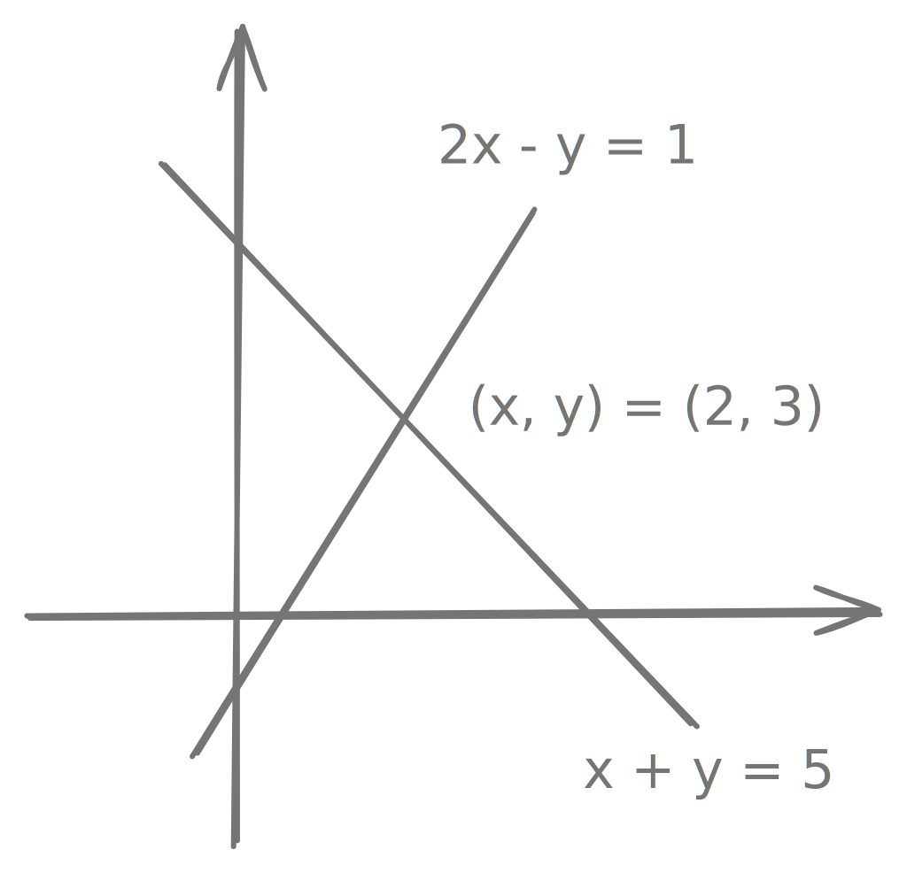
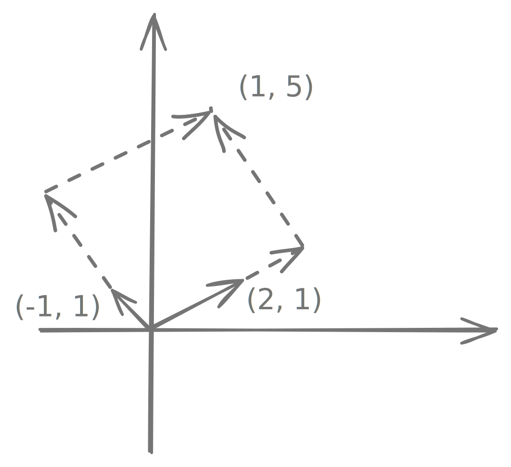

# Matrices and Guassian Elimination

## Introduction

$n$ equations in $n$ unknowns is the simplest and the most common case:

$$
\begin{align}
1x + 2y &= 3 \\
4x + 5y &= 6
\end{align}
$$

There are two ways to solve these. For large $n$, elimination wins.

### 1. Elimination

subtract 4 times the first equation from the second equation.

$$
\begin{align}
eq2 &- 4 \cdot eq1 \\ 
-3y &= -6 \\
y &= 2 \\
x &= -1 \text{ (back subtitution)}
\end{align}
$$

### 2. Determinants

the solution depends on size numbers in the equations.

$$
\begin{align}
y &= \dfrac{\begin{bmatrix}1 & 3\\4 & 6\end{bmatrix}}{\begin{bmatrix}1 & 2\\4 & 5\end{bmatrix}} = \dfrac{1\cdot 6 - 3\cdot 4}{1\cdot 5 - 2\cdot 4} = \dfrac{-6}{-3} = 2 \\
\\
x &= \dfrac{\begin{bmatrix}3 & 2\\6 & 5\end{bmatrix}}{\begin{bmatrix}1 & 2\\4 & 5\end{bmatrix}} = \dfrac{3\cdot 5 - 2\cdot 6}{1\cdot5 - 2\cdot 4} = \dfrac{3}{-3} = -1
\end{align}
$$

## Geometry of Linear Equations

$$
\begin{align}
2x - y &= 1 \\
x + y &= 5
\end{align}
$$

the system of linear equations can be treated in two ways:

### 1. rows

most familiar, where each row (i.e. equation) is representing a line in 2D space and our solution is their intersection point. In case of 3D, it is the intersection of planes.

{width=300}

### 2. columns

treat the two equations as a single **vector** equation, with $(2, 1)$ as being coefficient to $x$ and $(-1, 1)$ as coefficient to $y$.

$$
\begin{align}
x \begin{bmatrix}2\\1\end{bmatrix} + y \begin{bmatrix}-1\\1\end{bmatrix} = \begin{bmatrix}1\\5\end{bmatrix}
\end{align}
$$

{width=300}

## Gaussian Elimination Example

$$
\begin{align}
& \ \ \ \ \ \textbf{2}u \ \ + \ \ v \ \ \ \ + \ \ w \ \ \ \ = \ \ \ 5 \\
& \ \ \ \ \ 4u \ \ - \ \ 6v \ \ \ \ \ \ \ \ \ \ \ \ \ \ \ \ = -2 \\
& -2u \ \ + \ \ 7v \ \ + \ \ 2w \ \ = \ \ \ 9
\end{align}
$$

start by subtracting multiples of the first equation from the others, eliminating $u$ from the last two.

- $eq2 - 2\cdot eq1$
- $eq3 - 1\cdot eq1$

The coefficient of $u$ in the first equation is thus called the **first pivot**.

$$
\begin{align}
\textbf{2}u \ \ + \ \ v \ \ + \ \ \ \ w \ \ &= \ \ \ \ \ 5 \\
\textbf{-8}v \ \ - \ \ 2w \ \ &= -12 \\
8v \ \ + \ \ 3w \ \ &= \ \ \ 14
\end{align}
$$

in the second stage, we pick up the second pivot $-8$ and find multiple of that such that $v$ can be eliminated from the third equation.

$$
\begin{align}
\textbf{2}u \ \ + \ \ v \ \ + \ \ \ \ w \ \ &= \ \ \ \ \ 5 \\
\textbf{-8}v \ \ - \ \ 2w \ \ &= -12 \\
\textbf{1}w \ \ &= \ \ \ \ \ 2
\end{align}
$$

now the system is solved upwards, using **back substitution**. And we produced three pivots $2, -8, 1$. We can simplify the notation by importing the right side into the matrix.

$$
\begin{bmatrix}\ \ 2 & \ \ 1 & 1 & \ \ 5\\ \ \ 4 & -6 & 0 & -2\\-2 & \ \ 7 & 2 & \ \ 9\end{bmatrix} \rightarrow \begin{bmatrix}2 & \ \ 1 & \ \ 1 & \ \ \ 5\\0 & -8 & -2 & -12\\0 & \ \ 8 & \ \ 3 & \ \ 14\end{bmatrix} \rightarrow \begin{bmatrix}2 & \ \ 1 & \ \ 1 & \ \ \ 5\\0 & -8 & -2 & -12\\0 & \ \ 0 & \ \ 1 & \ \ \ 2\end{bmatrix}
$$

## Guassian Elimination Breakdowns

### 1. Nonsingular

cured by exchanging equation 2 and 3.

$$
\begin{bmatrix}1 & 1 & 1 \\ 2 & 2 & 5 \\ 4 & 6 & 8\end{bmatrix} \rightarrow \begin{bmatrix}1 & 1 & 1 \\ 0 & 0 & 3 \\ 0 & 2 & 4\end{bmatrix} \rightarrow \begin{bmatrix}1 & 1 & 1 \\ 0 & 2 & 4 \\ 0 & 0 & 3\end{bmatrix}
$$

### 2. Singular

incurable, as there is no exchange that can avoid zero in second pivot position. 
$$
\begin{bmatrix}1 & 1 & 1 \\ 2 & 2 & 5 \\ 4 & 4 & 8\end{bmatrix} \rightarrow \begin{bmatrix}1 & 1 & 1 \\ 0 & 0 & 3 \\ 0 & 0 & 4\end{bmatrix}
$$

The equations themselves can be solvablae or not, dependending on whether they are consistent or not. For example, if the second equation is $3w = 6$ and the third equation is $4w = 8$, then we'll have inifine number of solutions.
